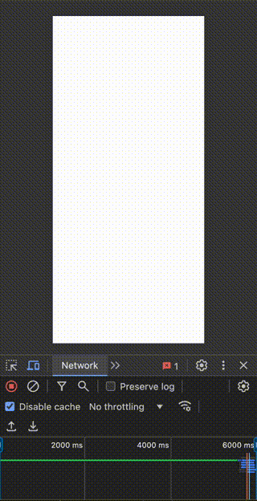
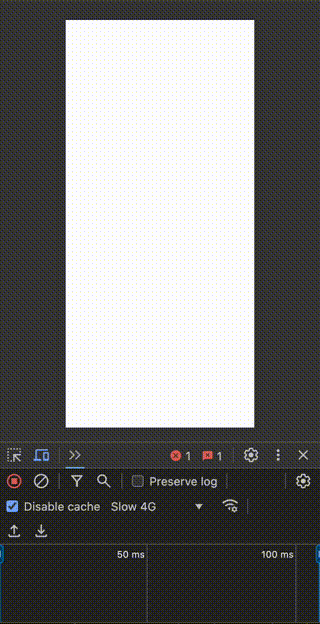
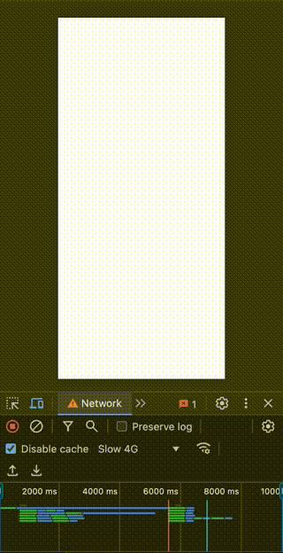
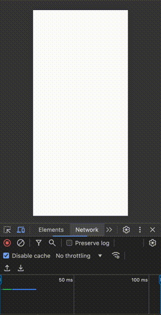

# Next.js の PPR（Partial Prerendering）とは？動的コンテンツを高速に提供する新たなレンダリング手法

## はじめに：PPR（Partial Prerendering）とは？

Next.js 14 では Partial Prerendering（以降 PPR）という新しいレンダリング手法が実験的にサポートされています。

従来の Server Side Rendering（以降 SSR） がページ全体のデータをサーバーで生成し、完了後にまとめてクライアントに送信するのに対し、PPR ではビルド時に静的データを生成(Static Rendering)しつつ、動的データはサーバーがデータを生成(Dynamic Rendering)しながら少しずつクライアントに送信します。これにより、初回表示までの時間が大幅に短縮され、UX の向上に繋がります。

この記事では、PPR の仕組みやそのメリット、実装方法について詳しく見ていきます。

## PPR のメリット

PPR のメリットは、ページの初回表示速度の向上やユーザー体験の改善にあります。主なメリットは以下の通りです：

### 初回表示までの時間短縮

必要なデータが揃い次第、順次クライアントに送信されるため、ユーザーはすぐにページの一部を確認でき、待ち時間が短縮されます。

### UX 向上

重要な部分を先に表示し、残りの要素が順次読み込まれることで、ユーザーにとってスムーズな体験が提供されます。

### パフォーマンスの最適化

サーバーで一括生成するよりも効率的にリソースを利用できるため、大規模なページや重いコンテンツを含むページ、API からデータをフェッチする頻度が高いケースでパフォーマンスが向上します。

## PPR の仕組み

PPR では、先述したようにページを生成する際に既に作られた静的データを返しつつ、サーバーからデータが到達した順にレンダリングを進め、必要なパーツをクライアントに逐次送信します。

つまり同じページ内で静的・動的データが混ざっていても、動的データが生成されるのを待たずに、静的データを先に返すことができます。

そのため、ユーザーはページの一部をすぐに確認でき、残りのデータが揃うまでの間もスムーズな表示が維持されます。


※[Next.js Streaming with Suspense](https://nextjs.org/docs/canary/app/building-your-application/routing/loading-ui-and-streaming#streaming-with-suspense)

### Streaming SSR との違い

PPR は Streaming SSR をさらに進化させた方法です。

PPR は静的データがビルド時に生成されるのに対して、Streaming SSR はリクエストの際にサーバー上で生成します。

つまり PPR は、静的データがビルド時に生成されているため、サーバー上でコンテンツの生成を待つ必要がなく、初期表示がさらに高速化します。

## PPR の実装方法

ここでは例として[ポケコロアイテム図鑑](https://library.pokecolo.com/)におけるお客様情報の表示を挙げます。

アイテム図鑑のコンテンツは頻繁に更新されないため SSG や ISR で静的データを生成します。
一方でお客様情報は、データを取得して表示する必要があるため、動的コンテンツである必要があります。


※[EC サイトの例\_Next.js Partial Prerendering](https://nextjs.org/docs/app/building-your-application/rendering/partial-prerendering)


ここでは SSR → Streaming SSR → PPR 順に実装します。

### SSR

Data Fetching のオプションに `cache: "no-store"`を追加するだけで、SSR が可能になります。

※[Next.js Partial Data Fetching](https://nextjs.org/docs/canary/app/building-your-application/data-fetching/fetching)

```tsx
// app/page.tsx
import Image from "next/image";
import StaticContents from "@/components/StaticContents";

export default function Home() {
  return (
    <main>
      <DynamicUserInfo />
      <StaticContents />
    </main>
  );
}

async function DynamicUserInfo() {
  const userInfo: IUserInfo = await fetch("https://dummyjson.com/userInfo", {
    cache: "no-store", // no-storeを追加することでSSRになります。
  }).then((res) => res.json());
  await new Promise((resolve) => setTimeout(resolve, 5000)); // 5秒遅延させます。

  return (
    <section className="colonian-info animate-fade">
      <div className="profile">
        <Image
          src={userInfo.imgSrc}
          width="64"
          height="64"
          className="image"
          alt={"image"}
        />
        <p className="mycode">{`ID:${userInfo.userId}`}</p>
        <p className="nickname">{userInfo.nickName}</p>
      </div>
    </section>
  );
}

interface IUserInfo {
  imgSrc: string;
  nickName: string;
  userId: string;
}
```

`DynamicUserInfo`はお客様情報を表示する動的コンポーネントです。

ここでは、Data Fetching 後５秒間遅延させてみます。



このように SSR の場合、Data Fetching している５秒間の間は何も表示されません。（白い画面が表示）

そして、アクセスからおよそ 6 秒が経った時点で、全ての情報が一気に表示されるのが分かります。

### Streaming SSR

次は SSR を Streaming SSR に変更してみます。

`Suspense`を追加するだけで、Streaming SSR に変更できます。

※[Next.js Streaming with Suspense Example](https://nextjs.org/docs/app/building-your-application/routing/loading-ui-and-streaming#example)

```tsx
import { Suspense } from "react"; // ① Suspenseをimportします
import Image from "next/image";
import Skeleton from "@/components/Skeleton";
import StaticContents from "@/components/StaticContents"

export default function Home() {
  return (
    <main>
        {/*
        　　② 動的コンテンツにSuspenseをラップします。
        　　fallbackには動的コンテンツがレンダリングされる前に、表示しておくUIコンポーネントを入れます。
        */}
        <Suspense fallback={<Skeleton />}>
            <DynamicUserInfo />
        </Suspense>
        <StaticContents />
    </main>
  );
}


async function DynamicUserInfo() {
    ...
}

```

`Suspense`の`fallback`には動的データを読み込む際に表示する代替要素を入れます。



より分かりやすくするため、ネットワーク速度を落としました。

お客様情報が読み込まれる間には代替要素（Skeleton）が表示され、同時にアイテム図鑑が表示されるのが分かります。

そして、アクセスからおよそ 6 秒が経った時点で、お客様情報が表示されるのが分かります。

このように、実際のお客様情報が読み込まれるまでの間に、ユーザーに視覚的なフィードバック（アイテム図鑑の情報）を与えることができます。

### PPR

最後に Streaming SSR を PPR に変更してみます。

まず`next.config.mjs`にオプションを追加します。

```mjs
// next.config.mjs

/** @type {import('next').NextConfig} */
const nextConfig = {
  experimental: {
    ppr: "incremental", // ppr: boolean | "incremental" _ trueの場合は全てのページに適応されます, "incremental"の場合は指定したRouteに適応されます
  },
};

export default nextConfig;
```

次に、PPR を設定する Route に`export const experimental_ppr = true;`を追加します。

```tsx
export const experimental_ppr = true; // 追加

export default function Page() {
  ...
  <Suspense fallback={<Loading />}>
    <DynamicContents />
  </Suspense>
  ...
}
```

以上で、`export const experimental_ppr = true;`が追加された Route は PPR になります。

もしプロジェクト全体に適応させたい場合は、`next.config.mjs`の ppr オプションを true にします。



より分かりやすくするため、ネットワーク速度を落としました。

今回は静的データが非常に軽いため、Streaming SSR との差はほぼありません。

PPR に変更することで、`Suspense`外部の要素がビルド時に静的化され、Streaming SSR に比較してより高速に`Suspense`外部のコンテンツ（アイテム図鑑の情報）が表示されます。

SSR と PPR を並べて比較すると初期表示までの差が鮮明に分かります。

 

## まとめ

Next.js の PPR は、動的なページや重いコンテンツを効率的に提供するための強力なツールです。必要なデータが到達した段階で少しずつレンダリングを進めることで、ユーザーにスムーズでストレスのない体験を提供します。初回表示速度や UX を重視するプロジェクトでぜひ活用してみてください。

## 参考

[Next.js Partial Prerendering](https://nextjs.org/docs/app/building-your-application/rendering/partial-prerendering)

[PPR - pre-rendering 新時代の到来と SSR/SSG 論争の終焉](https://zenn.dev/akfm/articles/nextjs-partial-pre-rendering)

[Youtube - Next.js Visually Explained: Partial Pre-rendering (PPR)](https://www.youtube.com/watch?v=MTcPrTIBkpA&ab_channel=Delba)
